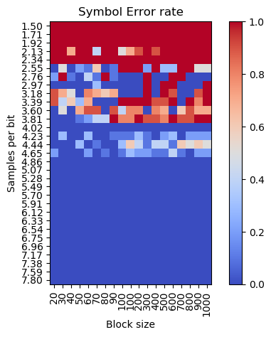

# sylvhronizer

Sylvain's proposed synchronizer

## Motivation

To have a "zeroconf" GNU Radio block for synchronizing and sampling easy to see, low noise and well behaved square signals.

## Idea 

* Start with a hint of nominal samples per symbol.
* Do not resample: just alternate between +/- 1 sample guaranteeing average consistency.
* Update internal state with zero-crossings.

## Performance

